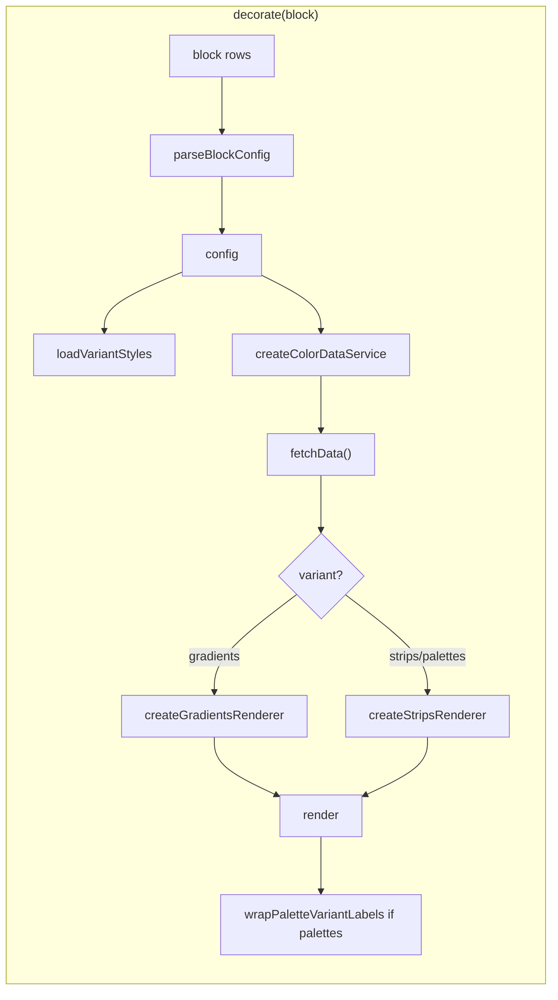

# color-explore block

**Purpose:** Display shared strip/summary components only. No wrappers, no wiring focus.

**Notes:** Keep clarifications in this README only; no comments in `color-explore.css` or `color-explore.js`.

- Palette strips: **`<color-palette>` WC** only (via `createPaletteAdapter`). Future non-palette variants may use `createColorStrip` / `createSummaryStripCard` from `dev/MWPW-187682/` (not in this PR).
- Strips/palettes variant: direct rendering (no card chrome, no result-list). Contract: `color-shared/components/strips/SHARED_COMPONENT_CONTRACT.md`.

---

## Flow

---

## Implementation notes

| Layer | Notes |
|-------|--------|
| **CSS** | Variant CSS loaded in JS by variant (gradient vs strip). This file: block layout + tokens only. Strips/palette styling in `color-strip.css`. Breakpoints: tablet 768px+, desktop 1024px+. |
| **JS** | `loadVariantStyles(variant, loadStyle, codeRoot)`. `wrapPaletteVariantLabels(container)` for Size L/M/S label. Decorate skips if already decorated. |
