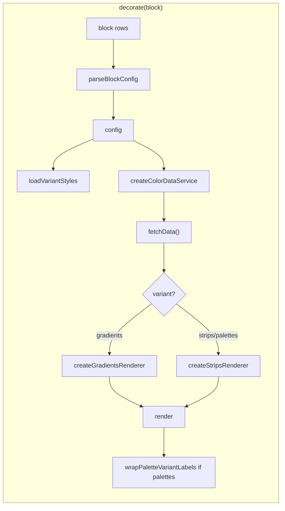

# color-explore block

**Purpose:** Display shared strip/summary components only. No wrappers, no wiring focus.

**Notes:** Keep clarifications in this README only; no comments in `color-explore.css` or `color-explore.js`.

- Palette strips: **`<color-palette>` WC** only (via `createPaletteAdapter`). Future non-palette variants may use `createColorStrip` / `createSummaryStripCard` from `dev/MWPW-187682/` (not in this PR).
- Strips/palettes variant: direct rendering (no card chrome, no result-list). Contract: `color-shared/components/strips/README.md`.

---

## Flow

```mermaid
flowchart LR
  subgraph decorate["decorate(block)"]
    A["block rows"] --> B["parseBlockConfig"]
    B --> C["config"]
    C --> D["loadVariantStyles"]
    C --> E["createColorDataService"]
    E --> F["fetchData()"]
    F --> G{"variant?"}
    G -->|gradients| H["createGradientsRenderer"]
    G -->|strips/palettes| I["createStripsRenderer"]
    H --> J["render"]
    I --> J
    J --> K["wrapPaletteVariantLabels if palettes"]
  end
```

---

## Implementation notes

| Layer | Notes |
|-------|--------|
| **CSS** | Variant CSS loaded in JS by variant (gradient vs strip). This file: block layout + tokens only. Strips/palette styling in `color-strip.css`. Breakpoints: tablet 768px+, desktop 1024px+. |
| **JS** | `loadVariantStyles(variant, loadStyle, codeRoot)`. `wrapPaletteVariantLabels(container)` for Size L/M/S label. Decorate skips if already decorated. |

---

## Palette Grid Review Notes

This section folds in the previous `PALETTE-GRID-VARIANTS-FOR-REVIEW.md`.

**Naming**
- Explore page variants are **Gradient** and **Palette Strips**.
- **Summary** refers only to Figma [5806-89102](https://www.figma.com/design/mcJuQTxJdWsL0dMmqaecpn/Final-Color-Expansion-CCEX-221263?node-id=5806-89102) (palette summary card).

**Separation**
- Normal rendering (integration): Strips L/M/S, Strip container, Palette summary, Palette Strips grid.
- Static for review only: demo section with Simplified and Horizontal.
- Compact demo variant is intentionally removed for now.

### Integration rendering

| Section | Description | Renderer |
|---------|-------------|----------|
| **Strips (L/M/S)** | One row, three palette cards (L, M, S). Grid 1/2/3 cols. | `createStripsRenderer` with `simpleSizeVariants: true` |
| **Strip container** | Vertical/horizontal strip container (Figma 6215). | `createStripContainerRenderer` |
| **Palette summary** | Summary card (Figma 5806-89102): title, count, strip. | `createPaletteSummaryRenderer` |
| **Palette Strips** | Explore grid: `color-card` + `color-shared-palette-strip`. | `createStripsRenderer` with `renderGridVariant: 'summary'` |

Layout rules:
- Max container: 1440px
- Content max: 1360px
- Gap: 24px
- Grid columns: 1 mobile, 2 tablet (600px+), 3 desktop (1200px+)

### Demo-only variants

- Demo section appears below integration content.
- Includes Simplified and Horizontal variants for design/QA review.
- Controlled via `showDemoVariants: true` in `createStripsRenderer`.

### Files to review first

- `express/code/blocks/color-explore/color-explore.js`
- `express/code/blocks/color-explore/color-explore.css`
- `express/code/scripts/color-shared/components/strips/color-strip.css`
- `express/code/scripts/color-shared/renderers/createStripsRenderer.js`
- `express/code/scripts/color-shared/renderers/createStripContainerRenderer.js`
- `express/code/scripts/color-shared/renderers/createPaletteSummaryRenderer.js`
- `express/code/scripts/color-shared/palettes/palettes.css`
