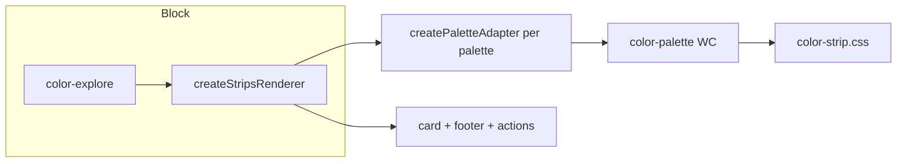

# Strip & Summary Card — Contract (MWPW-187682)

**Scope:** Contract and API only. Strip UI under `components/strips` only (no `components/palette`). CSS notes: `STRIPS_IMPLEMENTATION_NOTES.md`. Vanilla strip for non-palette variants: `dev/MWPW-187682/` (not in this PR).

**Palette strips:** Use **`<color-palette>` WC** via `createPaletteAdapter()` in `adapters/litComponentAdapters.js`. Explore, modal, global-colors-ui use it. Do not use `createColorStrip` for palette cards.

---

## Flow (strips/palettes)

---

## `<color-palette>` WC

| Input | Description |
|-------|-------------|
| `palette` | `{ name?, colors: string[] }` (hex) |
| `show-name-tooltip` | Optional; false when name in footer |
| `palette-aria-label` | Pill aria-label: `{hex}`, `{index}` |
| Events | `ac-palette-select` → detail `{ palette, searchQuery, selectionSource }` |

Style via CSS vars on host: `--color-palette-min-height`, `--color-palette-border-radius`, `--color-palette-border-width`, etc. L/M/S: vars only; no JS layout.

**JS we add:** Card wrapper, footer (name + Edit/View), `ac-palette-select` + click/keydown with `closest()` so actions don’t open card. Modal: container + WC, optional `onSelect`.

**Vanilla strip:** Only for non-palette (summary strip, hex labels, color-blindness label). For `{ name, colors }` always use WC.

---

## L/M/S width (horizontal strip)

| Size | max-width |
|------|-----------|
| default / L | 518px |
| M | 400px |
| S | 280px |

`width: 100%`; strip does not expand past max. Summary-card strip: 180×36 (Figma 6407/5806). **Breakpoints:** Orchestrator/block CSS only; shared strip CSS has no media queries.

---

## createColorStrip / createSummaryStripCard (dev only)

- **createColorStrip(colors, options):** Returns `.ax-color-strip` root. Options: orientation, compact, showLabels, colorBlindnessLabel, cornerRadius, gapSize, sizing, className.
- **createSummaryStripCard(opts):** Returns `.ax-color-strip-summary-card`; opts: title, count, strip, actions.

Consumers call APIs and place elements; no wrappers from shared layer. color-explore: display-only, up to 3 items per variant.
