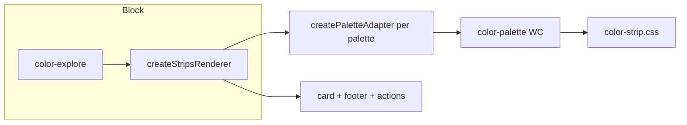

# Strips folder — Contract (MWPW-187682)

**Scope:** This folder (`components/strips`) only. Contract and API for strip & summary-card UI. CSS notes: `STRIPS_IMPLEMENTATION_NOTES.md`. Vanilla strip for non-palette variants: `dev/MWPW-187682/` (not in this PR).

**Palette strips:** Use **`<color-palette>` WC** via `createPaletteAdapter()` in `adapters/litComponentAdapters.js`. Explore, modal, global-colors-ui use it. Do not use `createColorStrip` for palette cards.

---

## Flow (strips/palettes)



---

## `<color-palette>` WC

| Input | Description |
|-------|-------------|
| `palette` | `{ name?, colors: string[] }` (hex) |
| `show-name-tooltip` | Optional; false when name in footer |
| `palette-aria-label` | Pill aria-label: `{hex}`, `{index}` |
| Events | `ac-palette-select` → detail `{ palette, searchQuery, selectionSource }` |

Style via CSS vars on host: `--color-palette-min-height`, `--color-palette-border-radius`, `--color-palette-border-width`, etc. L/M/S: vars only; no JS layout.

**JS we add:** Card wrapper, footer (name + Edit/View), `ac-palette-select` + click/keydown with `closest()` so actions don't open card. Modal: container + WC, optional `onSelect`.

**Vanilla strip:** Only for non-palette (summary strip, hex labels, color-blindness label). For `{ name, colors }` always use WC.

---

## L/M/S width (horizontal strip)

| Size | max-width |
|------|-----------|
| default / L | 518px |
| M | 400px |
| S | 280px |

`width: 100%`; strip does not expand past max. Summary-card strip: 180×36 (Figma 6407/5806). **Breakpoints:** Orchestrator/block CSS only; strip CSS in this folder has no media queries.

**Palette grid layout (vertical variant):** Owned by the component only — not consumers. Vertical never renders more than 6 cards in one row; if 6+ cards, use two columns (two rows). In `color-strip.css`: `.palettes-grid` has 1 col mobile; 600px+ max 6 cols; `.palettes-grid--two-cols` → 2 cols. Gap `--palette-grid-gap` (24px). `createStripsRenderer` adds `palettes-grid--two-cols` when `getData().length >= 6`. Consumers must not override grid-template-columns or gap for `.palettes-grid`.

---

## createStripsRenderer — palette-card API

**When `config.simpleSizeVariants === true`:** Renders up to 3 `.palette-card` (L/M/S) with `.palette-card__strip-wrap` (strip) + footer (name, Edit, View). **Card contract:** Strip↔footer gap is `--palette-card-strip-footer-gap` (10px, Figma); demo and grid must not override `.palette-card` gap. **Focus rings:** Card and footer use `overflow: visible` by default; only `.palette-card__strip-wrap` clips (`overflow: hidden`), so focus rings on the card and action buttons are never clipped. Consumers must not set `overflow: hidden` on the card.

| Config | Type | Default | Description |
|--------|------|---------|-------------|
| `simpleSizeVariants` | boolean | — | If true, render 3 cards only (no search/filters, no factory sections). |
| `stripOptions` | object | `{ orientation: 'horizontal' }` | Passed to `createPaletteAdapter`. Omit or `orientation: 'horizontal'` for wide strip; `orientation: 'vertical'` for narrow strip. |
| `cardFocusable` | boolean | `true` | When true, card is focusable (`tabindex="0"`), has `role="group"` and `aria-label`. When false, card has `tabindex="-1"` (not in tab order). Card is **never a link** (always a `div`); only Edit and View action icons are links or buttons. **Opening the modal** is only via the **View action icon**, not the strip or card. Applies to both **palette-card** (Strips L/M/S) and **color-card** (grid SUMMARY/COMPACT). |

**Keyboard / tab:** When `cardFocusable: true`, tab order is card → Edit → View. View action opens the palette modal. When grid controls navigation, set `config.cardFocusable: false` and implement roving tabindex at grid level (same pattern as MWPW-185804 gradients).

**Example (standalone — Strips L/M/S):**

```js
const renderer = createStripsRenderer({
  container: sectionEl,
  data,
  config: { simpleSizeVariants: true },
});
renderer.render(sectionEl);
wrapPaletteVariantLabels(sectionEl);
```

**Example (grid — card not a tab stop):**

```js
const renderer = createStripsRenderer({
  container: gridEl,
  data,
  config: { simpleSizeVariants: true, cardFocusable: false },
});
renderer.render(gridEl);
```

**Demo actions:** When `config.showDemoVariants` is true, palette-card Edit uses a mock link (`href="#"`) and View opens the palette modal (emits `palette-click`). Use for review/demo pages so both actions are usable without real edit/view URLs.

---

## `<color-swatch-rail>` WC — Contract and API

**Source:** `express/code/libs/color-components/components/color-swatch-rail/` (Lit). Used for interactive strip cells (hex, copy, drag, lock, base color, etc.) in vertical, stacked, and two-rows layouts.

### Component API

| Property / attribute | Type | Default | Description |
|----------------------|------|---------|-------------|
| `controller` | object | — | State controller (swatches, baseColorIndex, lockedByIndex); required for interactivity. |
| `orientation` | string | `'vertical'` | `'vertical'` \| `'stacked'` \| `'two-rows'`. Adapter-only: `'vertical-responsive'` = &lt;1200px stacked, ≥1200px vertical; adapter resolves and listens for resize (component is not viewport-aware). |
| `embedded` | boolean | false | When true, rail has no border-radius (parent handles it). |
| `swatchFeatures` | object or array | — | Feature flags: `copy`, `colorPicker`, `lock`, `hexCode`, `trash`, `drag`, `addLeft`, `addRight`, `editTint`, `colorBlindness`, `baseColor`, `emptyStrip`, `editColorDisabled`. Object or array of keys; `'all'` enables all. |

**Add left / add right / empty:** Fully implemented by the component. No custom add or empty-strip UI in shared or block — pass `swatchFeatures: { addLeft, addRight, emptyStrip }` (or include in array) to enable. Add-left = between 1st and 2nd column (insert 1); add-right = between 2nd and 3rd (insert 2); emptyStrip = trailing “Add color” column when under max swatches. Event `color-swatch-rail-add` (detail: `{ side, insertIndex }`); component updates controller unless `preventDefault`.

**Events:** `color-swatch-rail-reorder` (detail: `{ fromIndex, toIndex, swatches }`). Copy/edit/trash/base/lock/color-blindness are handled internally or via controller.

### Group navigation (keyboard contract)

- **Tab:** One tab stop per swatch column (group). Inner controls are not in tab order until the column is “entered.”
- **Enter / Space (when column has focus):** “Enter” the column: focus moves to the first *visible* focusable (hex button or first icon). Hidden native color input (`.edit-input-native`) is skipped via `getFirstFocusableInGroup`.
- **Tab (after Enter):** Moves among controls inside the column; leaving the column collapses the group (inner `tabindex` set back to `-1`).
- **Arrow keys (when column has focus):** Move focus to previous/next column. **Arrow keys (when inside column):** Move focus to previous/next control within the column (with wrap).
- **Escape (when inside column):** Return focus to the column. A polite screen-reader announcement states the focus target (e.g. "Focus on Color 1, #hex. Use arrow keys to move between colors, Enter to activate.") for a11y compliance (WCAG 4.1.3).

**Focus detection:** In Shadow DOM, the column is considered focused when `this.shadowRoot.activeElement === column` (since `document.activeElement` is the host).

### Shared util (libs/color-components/utils/util.js)

| Function | Signature | Description |
|----------|-----------|-------------|
| `getFirstFocusableInGroup` | `(container, focusableSelector, skipSelector?)` | Returns the first element matching `focusableSelector` that does *not* match `skipSelector` (default `'.edit-input-native'`), or the first match if none skipped. Use when entering a focus group so focus goes to a visible control. |

**DOM contract:** Inner focusables use class `.swatch-column-focusable` and default `tabindex="-1"`; the column has `tabindex="0"`, `role="group"`, and `aria-label="Color N, #HEX"` (or “Add color” for empty strip). On Enter, inner focusables get `tabindex="0"` and column gets `tabindex="-1"`; on focusout, they are reset.

### Accessibility: focus and announcements (WCAG / ARIA)

Per WCAG and ARIA, **every focusable element must have an accessible name** so the screen reader can announce it when focus moves there. We ensure: palette cards have `role="group"` and `aria-label="Palette: {name}"`; rail columns have `role="group"` and `aria-label="Color N, #hex"` or "Add color"; inner controls have `aria-label` or visible text. We **supplement** with live-region announcements only where focus changes were not announced reliably (e.g. after ESC back to card/column, Tab onto card).

---

## createColorStrip / createSummaryStripCard (dev only)

- **createColorStrip(colors, options):** Returns `.ax-color-strip` root. Options: orientation, compact, showLabels, colorBlindnessLabel, cornerRadius, gapSize, sizing, className.
- **createSummaryStripCard(opts):** Returns `.ax-color-strip-summary-card`; opts: title, count, strip, actions.

Consumers call APIs and place elements; no wrappers from shared layer. color-explore: display-only, up to 3 items per variant.
