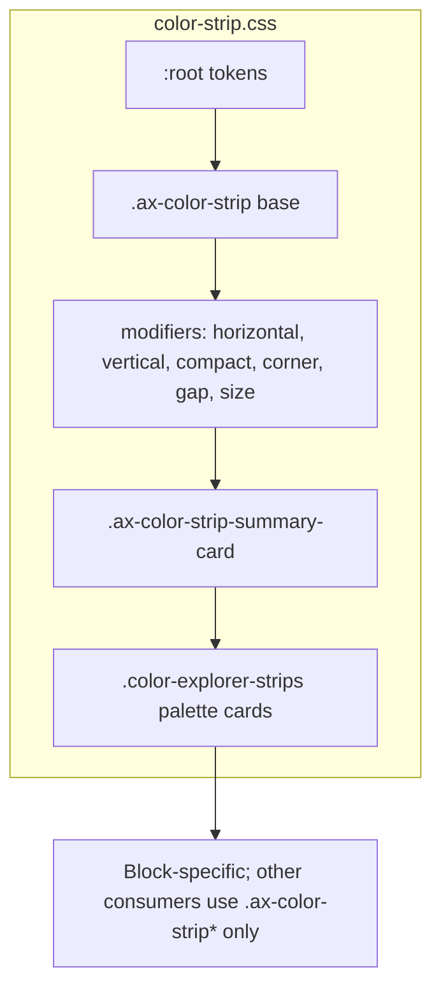

# color-strip.css — Implementation notes

**Notes only here;** no comments in the CSS file. MWPW-187682; Figma REST (figma-node-inspect.js).

---

## File structure

---

## Tokens & sections

| Section | Notes |
|---------|--------|
| **:root** | Figma tokens (3088-201177, 5674-67799). Use `var(--token)` only. `--gray-100` border; `--Palette-gray-100` background. L/M/S via `--strip-max-width`, `--strip-min-height` on `.palette-card--size-l/m/s`. |
| **Strip** | cornerRadius 5, itemSpacing 2, default 48px. Horizontal: L/M/S max-width; no expand to container. Vertical: gap 8; cells no padding; with-labels padding 4px. Compact 48px. Corners: 8/16px per Figma. Gap 2/4/8px; sizing 32/36/48. |
| **Summary card** | Padding 20, gap 20, strip 180×36, actions gap 6. Strip border 1px; itemSpacing 0 in summary. |
| **Palette cards** | `.color-explorer-strips` only (block-specific). L/M/S: 518/410/342, heights 80/56/56. Footer 32px, gap 10; name Label-M; actions gap 6; action buttons 32×32, radius 8, focus ring 2px. |
| **Media queries** | None in this file; breakpoints are orchestrator responsibility. |
| **Border** | Palette card strip uses 0.5px; can render inconsistently; use 1px if design allows. |
