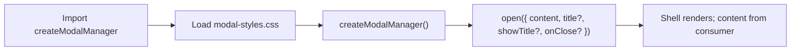

# Color shared modal (implementation)

Shell only; content is passed by the consumer. No comments in JS/CSS; this README is the source for contract, API, and defaults.

This folder: `createModalManager.js`, `modal-styles.css`, `modal-figma-tokens.css`, icons. Content is passed by the consumer. Screen reader announcements (aria-live) inlined in `createModalManager.js`.

---

## Contract

- **Shell provides:** Curtain, container, close button (direct child of container per Figma 5639-128522), optional title (h2), content slot. Layout: mobile-first — base = drawer (bottom sheet); 768px tablet; 1024px desktop modal. All classes **ax-color-** prefix; body state `.ax-color-modal-open`. Close icon: `express/code/icons/close.svg` (Figma CCEX-221263, node 9360-579358). No header wrapper. All content is supplied by the consumer.
- **Consumer must:** Import `createModalManager`, load `modal-styles.css` (it `@import`s `modal-figma-tokens.css`). Call `createModalManager()`, then `open({ content, ... })` to show content. Content can override shell styles (e.g. max-height, padding) via its own CSS; shell values are defaults.
- **CSS:** Shell uses tokens from Figma (via `modal-figma-tokens.css`) and eventually `styles.css`; not every value must be a token. No unsanitized or API-sourced HTML in content.

---

## API

**createModalManager()**  
Returns an object with an **open(options)** method.

**open(options)**

| Option | Required | Default | Description |
|--------|----------|---------|-------------|
| `content` | Yes | — | String (plain text, no HTML), DOM Node / DocumentFragment, or function returning string or Node. For rich HTML, pass a Node. |
| `title` | No | — | Accessible name (aria-label when title hidden). |
| `showTitle` | No | `false` | Pass `true` to show visible `<h2>` with `title`. |
| `onClose` | No | — | Callback when modal closes. |

Layout (drawer vs standard modal) is defined in `modal-styles.css` (breakpoints 768 / 1024). No mock or palette/gradient content in this folder; consumers supply content.

**Consumer flow:**

**modal-styles.css:** Curtain, container, breakpoints 768 / 1024. Imports `modal-figma-tokens.css`. Responsive: &lt;1024px drawer, ≥1024px standard modal. Max width 1680px, content area 1600px; mobile drawer content-sized (no min-height). Close: mobile hidden (backdrop tap + swipe); tablet/desktop visible, overflow for X only; content scrolls in `.ax-color-modal-content`. DOM: close + optional title as direct children; icon `icons/close.svg`. Accessibility: screen reader utilities, reduced motion respected.

**Figma:** CCEX-221263. Nodes 5525-290006 (mobile), 8039-662847 (tablet), 5639-128522 (desktop). Tokens in `modal-figma-tokens.css`. Verify alignment via REST API (e.g. node inspect script).
