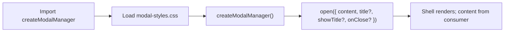

# Color shared modal (implementation)

Shell only; content is passed by the consumer. No comments in JS/CSS; this README is the source for contract, API, and defaults.

This folder: `createModalManager.js`, `modal-styles.css`, icons. Tokens are sourced from global `express/code/styles/styles.css`. Content is passed by the consumer. Screen reader announcements (aria-live) inlined in `createModalManager.js`.

---

## Contract

- **Shell provides:** Curtain, container, close button (direct child of container), optional title (h2), content slot. Layout: mobile-first — base = drawer (bottom sheet); 600px tablet (M); 1200px desktop modal (L). Breakpoints 600 / 1200. All classes **ax-color-** prefix; body state `.ax-color-modal-open`. Close icon: `express/code/icons/close.svg`. No header wrapper. All content is supplied by the consumer.
- **Consumer must:** Import `createModalManager`, load `modal-styles.css`, then call `createModalManager()`, and `open({ content, ... })` to show content. Content can override shell styles (e.g. max-height, padding) via its own CSS; shell values are defaults.
- **CSS:** Shell uses design tokens from global `styles.css`; not every value must be a token. No unsanitized or API-sourced HTML in content.

---

## API

**createModalManager()**  
Returns an object with an **open(options)** method.

**open(options)**

| Option | Required | Default | Description |
|--------|----------|---------|-------------|
| `content` | Yes | — | String (plain text, no HTML), DOM Node / DocumentFragment, or function returning string or Node. For rich HTML, pass a Node. |
| `title` | No | — | Accessible name (aria-label when title hidden). |
| `showTitle` | No | `false` | Pass `true` to show visible `<h2>` with `title`. |
| `onClose` | No | — | Callback when modal closes. |

Layout (drawer vs standard modal) is defined in `modal-styles.css` (breakpoints 600 / 1200). No mock or palette/gradient content in this folder; consumers supply content.

**Consumer flow:**

```mermaid
flowchart LR
  A["Import createModalManager"] --> B["Load modal-styles.css"]
  B --> C["createModalManager()"]
  C --> D["open({ content, title?, showTitle?, onClose? })"]
  D --> E["Shell renders; content from consumer"]
```

**modal-styles.css:** Curtain, container, breakpoints 600 / 1200. Uses global design tokens from `styles.css`. Responsive: &lt;600px drawer (S), 600–1199px tablet (M), ≥1200px standard modal (L). Max width 1680px, content area 1600px; mobile drawer content-sized (no min-height). Close: mobile hidden (backdrop tap + swipe); tablet/desktop visible, overflow for X only; content scrolls in `.ax-color-modal-content`. DOM: close + optional title as direct children; icon `icons/close.svg`. Accessibility: screen reader utilities, reduced motion respected.

---

## Modal Explore Content

**createModalExploreContent(item, opts)** — unified content for Color Explore modal. Handles gradient and strips variants. Shared: Floating Bar (mock), likes, author, tags. Used by `createModalManager.openPaletteModal` and `openGradientModal`.

| Option | Description |
|--------|--------------|
| `variant` | `'gradient'` or `'strips'` — preview type |
| `likesCount`, `creatorName`, `creatorImageUrl`, `tags` | Mock metadata (defaults when omitted) |
| `codeRoot` | Base path for icons and assets |

**modal-explore-content.css** — styles for gradient preview, color rail (strips), name/tags, floating toolbar. Loaded by `loadModalExploreContentStyles()`.

## Color Blindness Styles

- `modal-color-blindness.css` contains the modal-specific styles for color blindness simulation rows, swatch conflict indicators, and conflict summary presentation.
