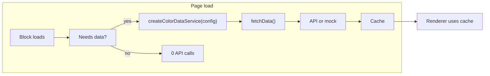
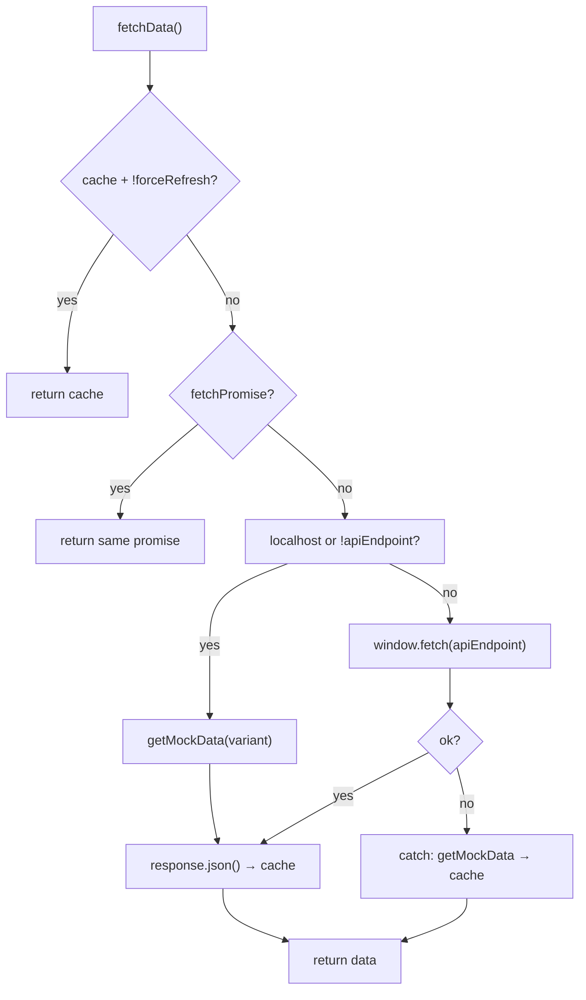

# Data Service Architecture — On-Demand Loading

**Data services are created only when blocks need them.** Related: `INITIALIZATION_ARCHITECTURE.md`, `createDependencyLoader.js`, `createPageInitService.js`.

---

## On-demand flow

---

## createColorDataService — fetch flow

---

## API calls by page

| Page | On load | On action |
|------|---------|-----------|
| **Explore** | 1 (color-explore, deduplicated) | Search/filter cached |
| **Extract** | 0 | 1 (upload) |
| **Color Wheel / Contrast / Color blindness** | 0 | 0 (client-side) |

Explore: with deep link → `color:init` → loadApi → search → render. No deep link → loadApi immediately → render. One API call either way.

---

## Features

- **On-demand:** Service created in block `decorate` when data needed.
- **Deduplication:** `globalDependencyLoader.loadApi(dataService)` — first call fetches; later calls reuse cached promise/data.
- **Cache:** Return cache unless `forceRefresh`. In-flight promise reused to avoid duplicate requests.
- **Mock fallback:** localhost or missing `apiEndpoint` → mock; on fetch error → log + mock.

---

## createColorDataService.js — implementation notes

**Notes in this file only;** no comments in the JS.

- **FIGMA_EXPLORE_PALETTE_COLORS:** Teal, sky blue, brown, peach, orange-red (Figma/spec).
- **FIGMA_EXPLORE_PALETTE:** First palette 3088-201177, name "Palette name lorem ipsum".
- **getMockPaletteList:** First from Figma; rest same colors.
- **fetch:** Cache + in-flight reuse; localhost/no endpoint → mock; on error → log + mock.
- **API:** `{ fetchData, fetch, search, filter, clearCache, loadMore }`.

---

## Best practices

- Create service only when block needs data (inside `decorate`).
- Use `dataService.search(query)` / filter on cached data; do not re-fetch for every search.
- Do not create a data service for pure client-side blocks (e.g. color wheel).
