# Color Tools Master Plan (Explore Palettes + Extract Palette)

This document consolidates:
- `EXPLORE_PALETTES_JIRA_TICKETS.md`
- `EXTRACT_PALETTE_JIRA_TICKETS.md`
- The associated diagram exports in the repo root (`*.png`)

It’s designed to be a **single source of truth**: architecture, event contracts, component inventory, ticket breakdowns, dependency graphs, and timelines — with both **embedded reference images** and **Mermaid equivalents**.

---

## Table of Contents

- [0. One-glance Summary](#0-one-glance-summary)
- [1. Shared Architecture (Both Features)](#1-shared-architecture-both-features)
  - [1.1 Layered System Diagram (Mermaid)](#11-layered-system-diagram-mermaid)
  - [1.2 Cross-layer Communication (Events + State)](#12-cross-layer-communication-events--state)
  - [1.3 Shared Components & Reuse Map](#13-shared-components--reuse-map)
  - [1.4 API Surface (High-level)](#14-api-surface-high-level)
- [2. Explore Palettes](#2-explore-palettes)
  - [2.1 Reference Diagrams (PNGs)](#21-reference-diagrams-pngs)
  - [2.2 Architecture & Variant Routing (Mermaid)](#22-architecture--variant-routing-mermaid)
  - [2.3 Core UX Flow (Mermaid)](#23-core-ux-flow-mermaid)
  - [2.4 Tickets (Condensed)](#24-tickets-condensed)
  - [2.5 Dependency Graph (Mermaid)](#25-dependency-graph-mermaid)
  - [2.6 Suggested Timeline (Mermaid Gantt)](#26-suggested-timeline-mermaid-gantt)
  - [2.7 Open Questions / Decisions](#27-open-questions--decisions)
- [3. Extract Palette](#3-extract-palette)
  - [3.1 Reference Diagrams (PNGs)](#31-reference-diagrams-pngs)
  - [3.2 Architecture & Variant Routing (Mermaid)](#32-architecture--variant-routing-mermaid)
  - [3.3 Core UX Flow (Mermaid)](#33-core-ux-flow-mermaid)
  - [3.4 Tickets (Condensed)](#34-tickets-condensed)
  - [3.5 Dependency Graph (Mermaid)](#35-dependency-graph-mermaid)
  - [3.6 Suggested Timeline (Mermaid Gantt)](#36-suggested-timeline-mermaid-gantt)
- [4. Combined Roadmap (Shared Components First)](#4-combined-roadmap-shared-components-first)
  - [4.1 Critical Path Highlights](#41-critical-path-highlights)
  - [4.2 Combined Dependency Graph (Mermaid)](#42-combined-dependency-graph-mermaid)
  - [4.3 Combined Timeline (Mermaid Gantt)](#43-combined-timeline-mermaid-gantt)
- [5. Appendix](#5-appendix)
  - [5.1 Repo Pointers (Planned Locations)](#51-repo-pointers-planned-locations)
  - [5.2 Event Names (Proposed Contract)](#52-event-names-proposed-contract)

---

## 0. One-glance Summary

### What we’re building
- **Explore Palettes**: A single `palette` (or `explore-palettes`) block with multiple authoring variants (grid/modal/horizontal/vertical/card) that fetches palettes from an API, supports filters/search, and opens a rich modal for actions and “Save to CC Libraries”.
- **Extract Palette**: A single `extract-palette` (or `extract-color`) block with palette/gradient variants that guides users through upload → processing → results → editing and actions (save/share/download/edit).

### What’s shared
- **Shared UI primitives**: `color-strip`, `color-action-button`
- **Shared behaviors**: clipboard copy, progress/loading states, responsive size variants, “save to CC Libraries” patterns, analytics patterns (optional)

### Why this matters
Shared components should be built once, with a stable API, then consumed by both feature stacks.

---

## 1. Shared Architecture (Both Features)

### 1.1 Layered System Diagram (Mermaid)

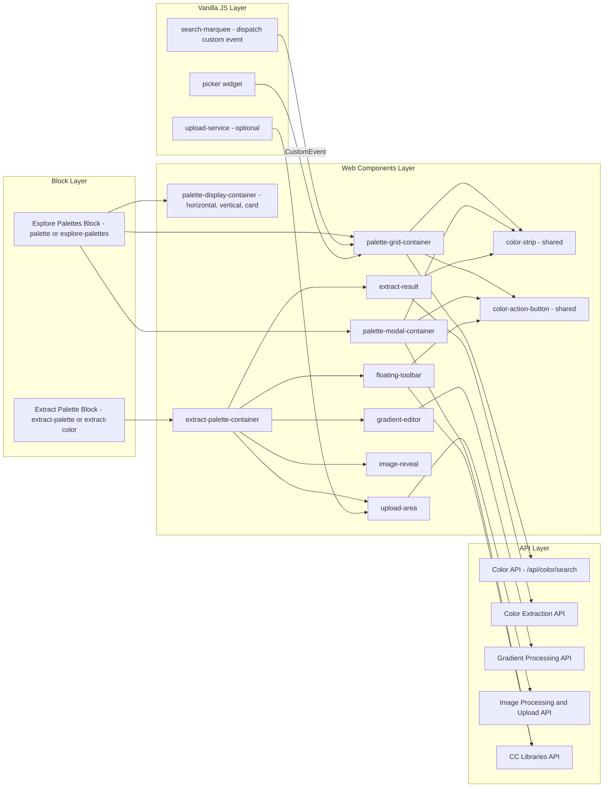

### 1.2 Cross-layer Communication (Events + State)

#### Primary communication patterns
- **Block → Web Component**: Decorator instantiates the appropriate Lit element based on authoring variant.
- **Vanilla JS → Web Component**: Blocks/widgets dispatch **CustomEvents** (or use a mediator) to avoid tight coupling.
- **Web Component → API**: Fetch calls with AbortController support; loading/error states managed inside components.

#### State categories (shared)
- **Query state**: search query, filters, sort, time range, type
- **UI state**: modal open/closed, dropdown open/closed, responsive size variant
- **Network state**: idle/loading/success/error, request cancellation/aborts

### 1.3 Shared Components & Reuse Map

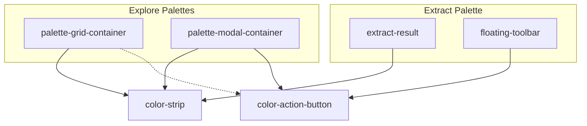

### 1.4 API Surface (High-level)

#### Color API (Explore Palettes)
- **Endpoint (assumed)**: `/api/color/search`
- **Parameters (assumed)**:
  - `q`: query string
  - `sort`: sort mode (e.g., popular, random, etc.)
  - `timeRange`: all / month / week
  - `type`: palettes / gradients

#### Extract Palette services (Extract Palette)
- **Image Upload / Processing**: upload and prepare image
- **Color Extraction**: produce palette colors (5–10+)
- **Gradient Processing**: produce/edit gradient stops
- **CC Libraries**: persist palette/gradient into libraries

> Notes: confirm exact endpoints and auth requirements with `express/docs/color-tools-backend-services.md` (if present).

---

## 2. Explore Palettes

### 2.1 Reference Diagrams (PNGs)

- Component Architecture:

  

- Implementation Phases:

  

- Implementation Plan:

  

### 2.2 Architecture & Variant Routing (Mermaid)

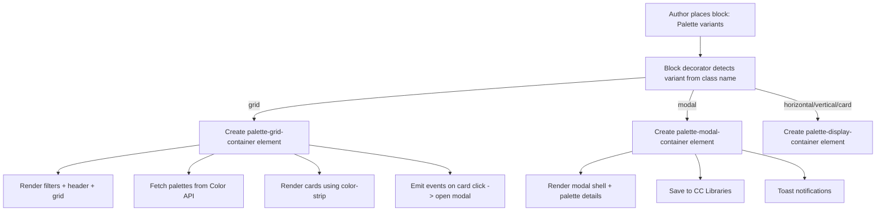

### 2.3 Core UX Flow (Mermaid)

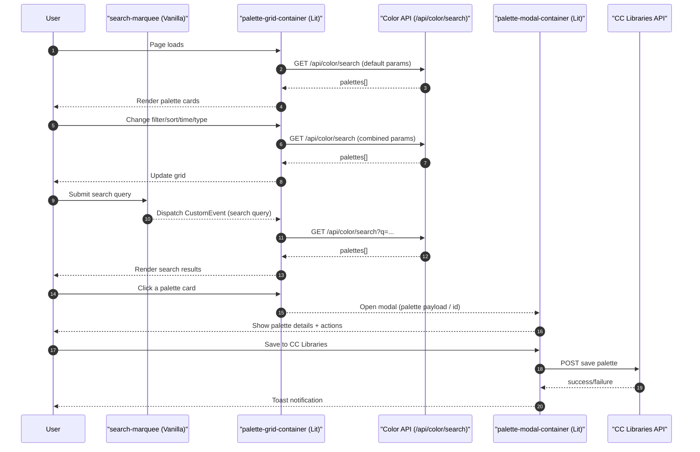

### 2.4 Tickets (Condensed)

#### Phase 1 — Core Features (Tickets 1–8)

- **Ticket 1 — Grid Variant (Foundation)**: 5 SP (20–24h)
  - Create block decorator + grid web component.
  - Create shared `color-strip` (used by grid + modal + extract).
  - Fetch + render initial palette grid; loading + error states.

- **Ticket 2 — Filter Dropdowns**: 3 SP (12–16h) — depends on T1
  - Type / Sort / Time filters using `picker` widget.
  - Mobile filter/sort panel alternative.

- **Ticket 3 — Filter API Integration**: 3 SP (12–16h) — depends on T1, T2
  - Map filter state → API params; debounce; AbortController cancelation.

- **Ticket 4 — Search Bar Integration**: 3 SP (12–16h) — depends on T1, T3
  - Enhance `search-marquee` to dispatch CustomEvent.
  - Grid listens and merges search state with filter state.

- **Ticket 5 — Search Bar Enhancement (Optional)**: 2 SP (8h) — depends on T4
  - Visual + behavior polish to match design, if needed.

- **Ticket 6 — Palette Card Actions**: 3 SP (12–16h) — depends on T1
  - Icon button system groundwork (`color-action-button` shared) + per-card actions.

- **Ticket 7 — Responsive Polish**: 1 SP (4h) — depends on Phase 1 tickets
  - 3/2/1 column breakpoints; touch targets; cross-device QA.

- **Ticket 8 — Analytics**: 2 SP (8h) — depends on Phase 1 tickets
  - Track card clicks, filter changes, search, and action button usage.

#### Phase 2 — Modal Features (Tickets 9–13)

- **Ticket 9 — Modal Basic Structure**: 3 SP (12–16h) — depends on T1
  - Modal shell, open/close, size variants (L/M/S), palette payload plumbing.

- **Ticket 10 — Modal Color Display & Actions**: 5 SP (20–24h) — depends on T9
  - Heavy `color-strip` functionality (hex display rules, copy, hover states, skeleton states).
  - Per-color action affordances (depends on action button system).

- **Ticket 11 — Save to CC Libraries**: 5 SP (20–24h) — depends on T9
  - Save form + dropdown states + tags + auth gating + API integration.

- **Ticket 12 — Toast Notifications**: 2 SP (8h) — depends on T11
  - Success/error toasts with dismiss + optional “View” CTA.

- **Ticket 13 — Action Buttons Integration**: 3 SP (12–16h) — depends on T6, T9
  - Wire edit/share/download/save/open-in-express actions.

### 2.5 Dependency Graph (Mermaid)

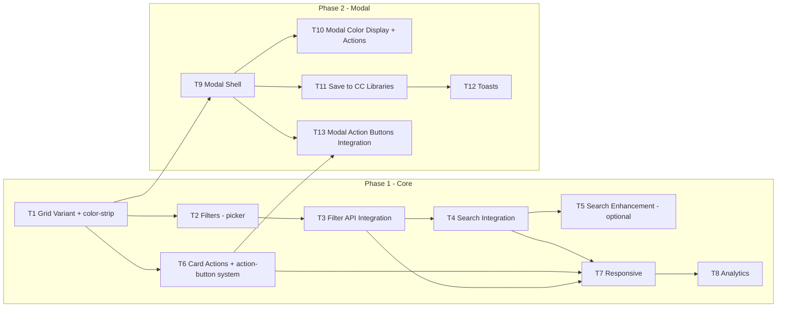

### 2.6 Suggested Timeline (Mermaid Gantt)

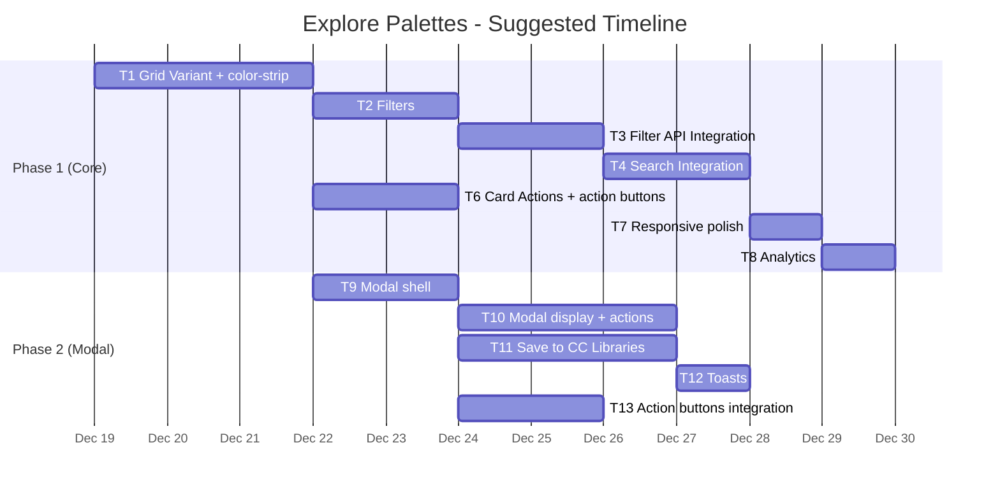

### 2.7 Open Questions / Decisions

- **API details**: confirm final `/api/color/search` params and defaults.
- **Search bar**: reuse `search-marquee` as-is vs any required UI changes.
- **State sharing**: CustomEvents vs mediator vs URL params for deep-linking.
- **Palette count**: static label vs dynamic count based on response totals.
- **Pagination**: load more vs infinite scroll vs single page of results.
- **Orientation overrides**: responsive auto-orientation vs authoring variant always wins.

---

## 3. Extract Palette

### 3.1 Reference Diagrams (PNGs)

- Component Architecture Flow:

  

- Implementation Plan Flow:

  

- Implementation Timeline:

  

### 3.2 Architecture & Variant Routing (Mermaid)

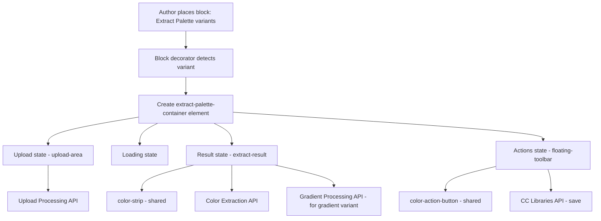

### 3.3 Core UX Flow (Mermaid)

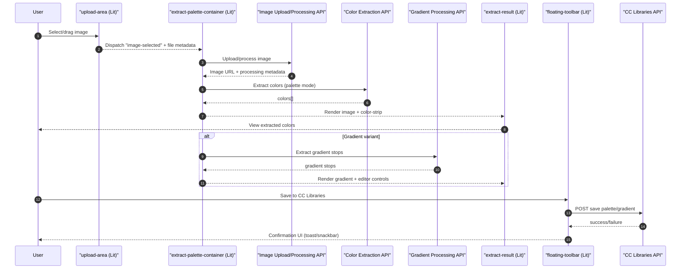

### 3.4 Tickets (Condensed)

#### Phase 1 — Foundation
- **Ticket 1 — Upload Area**: 3 SP (12–16h)
- **Ticket 2 — Loading State**: 2 SP (8h)
- **Ticket 11 — Main Page Integration**: 3 SP (12–16h)
  - Orchestrates page states and wiring across components.

#### Phase 2 — Core Extraction
- **Ticket 3 — Result Display**: 5 SP (20–24h) — depends on T1, T2; uses T4
- **Ticket 4 — Color Strip Component**: 3 SP (12–16h)
  - Should align with Explore Palettes’ `color-strip` API; build once if possible.
- **Ticket 5 — Floating Toolbar**: 4 SP (16–20h) — depends on T3

#### Phase 3 — Advanced Features
- **Ticket 6 — Image Reveal**: 4 SP (16–20h) — depends on T3
- **Ticket 7 — Color Editing Handles**: 3 SP (12–16h) — depends on T3, T4
- **Ticket 9 — Gradient Variant**: 3 SP (12–16h) — depends on T1, T2, T3; uses T8
- **Ticket 8 — Gradient Editor**: 4 SP (16–20h) — depends on T9

#### Phase 4 — Polish
- **Ticket 10 — Image Effects Integration**: 2 SP (8h) — depends on T6

### 3.5 Dependency Graph (Mermaid)

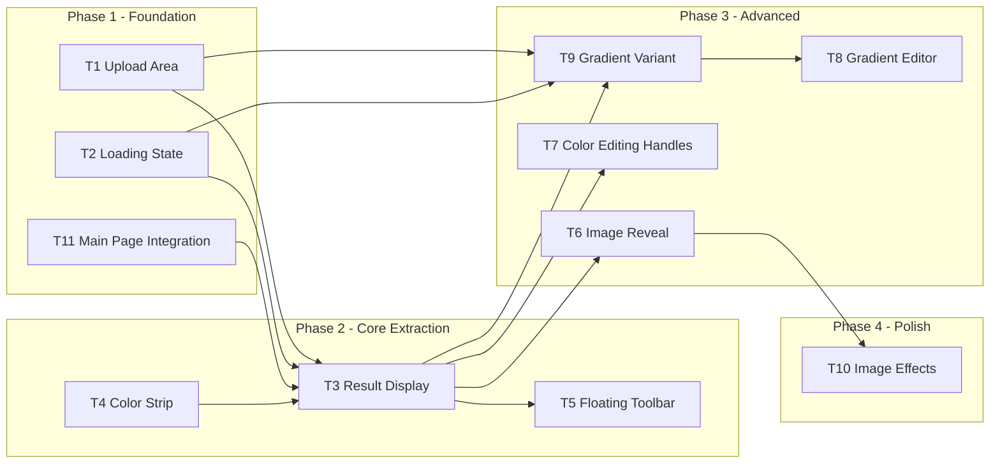

### 3.6 Suggested Timeline (Mermaid Gantt)

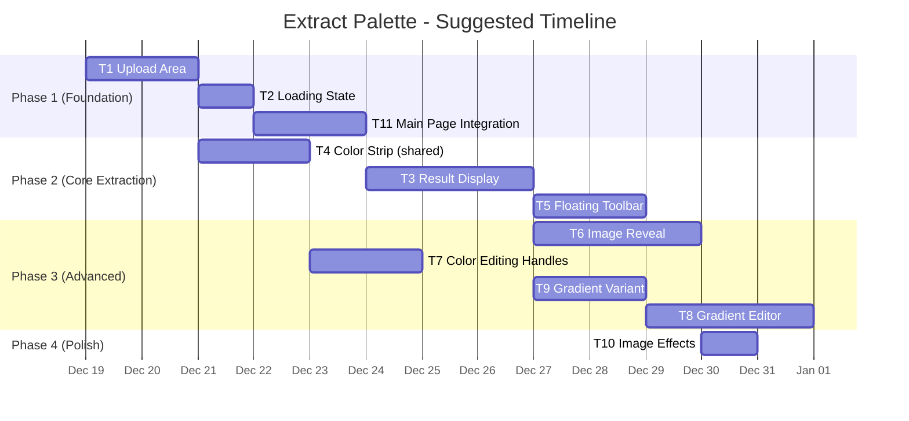

---

## 4. Combined Roadmap (Shared Components First)

### 4.1 Critical Path Highlights

#### Shared component gate
- **`color-strip`**: required by Explore (grid + modal) and Extract (results); build early with a stable interface.
- **`color-action-button`**: required by Explore modal actions and Extract toolbar actions; build early enough to avoid rework.

#### Explore Palettes critical path (typical)
- T1 → T2 → T3 → T4 → (T7) → (T9/T10/T11...) depending on priority

#### Extract Palette critical path (typical)
- T1 → T2 → T11 → T3 → T5 → (T6...) depending on priority

### 4.2 Combined Dependency Graph (Mermaid)

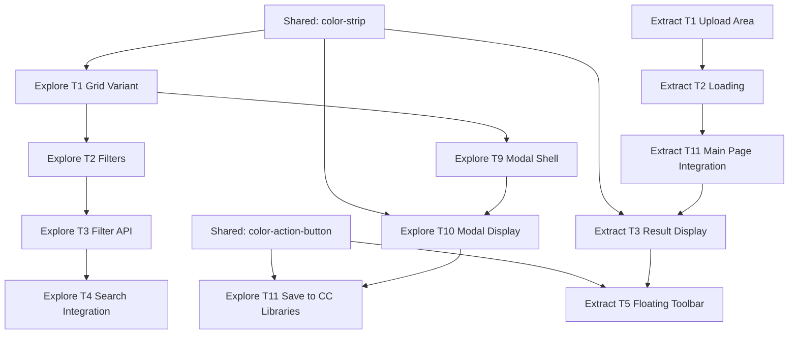

### 4.3 Combined Timeline (Mermaid Gantt)

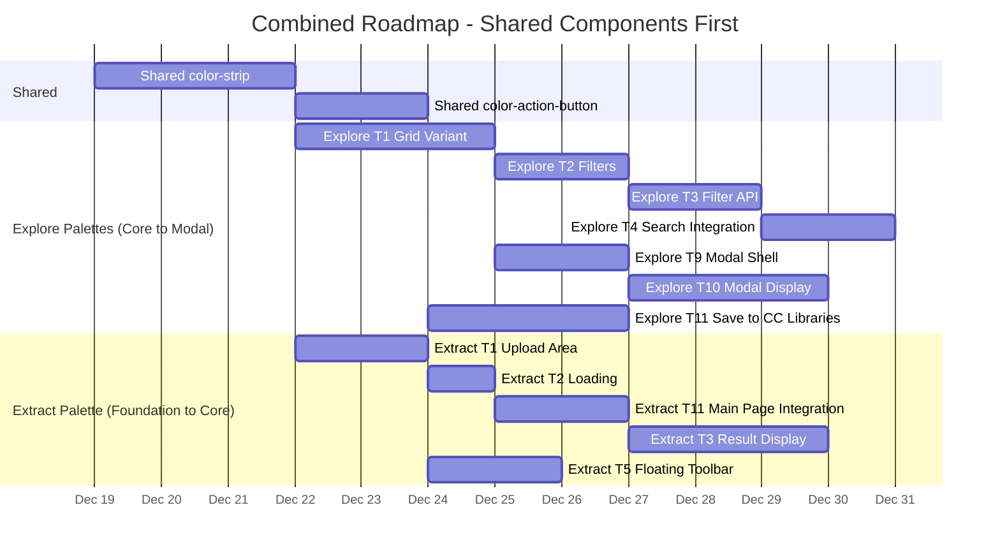

---

## 5. Appendix

### 5.0 Source Files & Diagram Links

#### Local source files (this repo)
- `EXPLORE_PALETTES_JIRA_TICKETS.md`
- `EXTRACT_PALETTE_JIRA_TICKETS.md`

#### Local diagrams (this repo)
- Explore Palettes:
  - `Explore Palettes - Component Architecture.png`
  - `Explore Palettes - Implementation Phases.png`
  - `Explore Palettes - Implementation Plan.png`
- Extract Palette:
  - `Extract Palette - Component Architecture Flow.png`
  - `Extract Palette - Implementation Plan Flow.png`
  - `Extract Palette - Implementation Timeline.png`

#### Original diagram sources (Figma boards linked in the source docs)
- Explore Palettes:
  - [Component Architecture](https://www.figma.com/online-whiteboard/create-diagram/bafaf0c2-26c9-49b0-8465-1c5d5bbf916c)
  - [Implementation Plan](https://www.figma.com/online-whiteboard/create-diagram/aaf9abd4-5ee7-447a-9562-f34fdb5cd115)
  - [Implementation Timeline](https://www.figma.com/online-whiteboard/create-diagram/44c07963-1727-4eea-979d-f39cedd7a063)
- Extract Palette:
  - [Component Architecture](https://www.figma.com/online-whiteboard/create-diagram/d67c3da8-17a0-43ae-bb81-8758c124ef51)
  - [Implementation Plan](https://www.figma.com/online-whiteboard/create-diagram/03c9af35-49da-4296-bfce-99fc204cd6d8)
  - [Implementation Timeline](https://www.figma.com/online-whiteboard/create-diagram/d7a1a4bf-0486-4f88-a92d-05da56315855)

### 5.1 Repo Pointers (Planned Locations)

#### Explore Palettes
- Block decorator:
  - `express/code/blocks/palette/palette.js`
  - (alternate existing): `express/code/blocks/explore-palettes/explore-palettes.js`
- Web components:
  - `express/code/libs/color-components/components/palette-grid-container/`
  - `express/code/libs/color-components/components/palette-modal-container/`
  - `express/code/libs/color-components/components/palette-display-container/`
- Widgets / vanilla integrations:
  - `express/code/blocks/search-marquee/search-marquee.js`
  - `express/code/scripts/widgets/picker.js`

#### Extract Palette
- Block decorator:
  - `express/code/blocks/extract-palette/` (name TBD)
- Web components:
  - `express/code/libs/color-components/components/extract-palette-container/`
  - `express/code/libs/color-components/components/upload-area/`
  - `express/code/libs/color-components/components/extract-result/`
  - `express/code/libs/color-components/components/floating-toolbar/`
  - `express/code/libs/color-components/components/image-reveal/`
  - `express/code/libs/color-components/components/gradient-editor/`

#### Shared components
- `express/code/libs/color-components/components/color-strip/`
- `express/code/libs/color-components/components/color-action-button/`

### 5.2 Event Names (Proposed Contract)

These are proposed to keep blocks loosely coupled while enabling composability.

- **Explore Palettes**
  - `ac-palette-search`: dispatched by `search-marquee` with `{ query }`
  - `ac-palette-filter-change`: optional; grid emits for analytics/URL syncing
  - `ac-palette-card-click`: grid emits with `{ paletteId | palette }` to open modal

- **Extract Palette**
  - `ac-image-selected`: upload emits with `{ file, source }`
  - `ac-extract-complete`: container emits with `{ colors | gradient }`
  - `ac-save-to-library`: toolbar emits with `{ payload }`

