# Color Tools Unified Architecture & Implementation Plan

> **Status:** Living Document  
> **Version:** 1.0.0  
> **Last Updated:** January 5, 2026  
> **Authors:** Brad Johnson (POC), Cano (Feature Planning), PLG Team (Architecture)

---

## Executive Summary

This document consolidates three separate planning efforts into a **single source of truth** for the Color Tools project in `da-express-milo`. It provides:

- **Architecture foundations** from the working POC
- **Feature breakdowns** for Explore Palettes and Extract Palette
- **Event naming conventions** and communication patterns
- **AEM EDS compliance** requirements
- **Implementation timelines** with dependency graphs

### What We're Building

| Feature | Description | Status |
|---------|-------------|--------|
| **Color Tools** | Interactive wheel + palette creation with tabs (Base, Image, Wheel) | POC Complete |
| **Explore Palettes** | Gallery with search, filters, and modal detail view | Planned |
| **Extract Palette** | Upload image → extract colors/gradients → save | Planned |

### Core Principles

1. **Extend the POC** — Don't rebuild what already works
2. **AEM EDS First** — Respect three-phase loading (Eager/Lazy/Delayed)
3. **Shared Components** — Build once, use everywhere
4. **Event-Driven Communication** — Loose coupling between layers
5. **Author Simplicity** — Complexity in JavaScript, not authoring

---

## Table of Contents

- [1. Architecture Overview](#1-architecture-overview)
  - [1.1 System Layers Diagram](#11-system-layers-diagram)
  - [1.2 Existing POC Foundation](#12-existing-poc-foundation)
  - [1.3 AEM EDS Three-Phase Loading](#13-aem-eds-three-phase-loading)
- [2. State Management Architecture](#2-state-management-architecture)
  - [2.1 ColorThemeController (Existing)](#21-colorthemecontroller-existing)
  - [2.2 Event Communication Patterns](#22-event-communication-patterns)
  - [2.3 Event Topic Naming Convention](#23-event-topic-naming-convention)
- [3. Component Library](#3-component-library)
  - [3.1 Existing Components](#31-existing-components)
  - [3.2 Proposed Shared Components](#32-proposed-shared-components)
  - [3.3 Component Reuse Map](#33-component-reuse-map)
- [4. Feature: Color Tools (POC)](#4-feature-color-tools-poc)
  - [4.1 Architecture](#41-architecture)
  - [4.2 Current Implementation](#42-current-implementation)
  - [4.3 Gap Analysis](#43-gap-analysis)
- [5. Feature: Explore Palettes](#5-feature-explore-palettes)
  - [5.1 Reference Diagrams](#51-reference-diagrams)
  - [5.2 Architecture & Routing](#52-architecture--routing)
  - [5.3 UX Flow](#53-ux-flow)
  - [5.4 Ticket Breakdown](#54-ticket-breakdown)
  - [5.5 Dependency Graph](#55-dependency-graph)
  - [5.6 Timeline](#56-timeline)
- [6. Feature: Extract Palette](#6-feature-extract-palette)
  - [6.1 Reference Diagrams](#61-reference-diagrams)
  - [6.2 Architecture & Routing](#62-architecture--routing)
  - [6.3 UX Flow](#63-ux-flow)
  - [6.4 Ticket Breakdown](#64-ticket-breakdown)
  - [6.5 Dependency Graph](#65-dependency-graph)
  - [6.6 Timeline](#66-timeline)
- [7. Backend Services](#7-backend-services)
  - [7.1 Service Inventory](#71-service-inventory)
  - [7.2 API Contracts](#72-api-contracts)
  - [7.3 Proxy Pattern](#73-proxy-pattern)
- [8. Combined Roadmap](#8-combined-roadmap)
  - [8.1 Critical Path](#81-critical-path)
  - [8.2 Combined Dependency Graph](#82-combined-dependency-graph)
  - [8.3 Master Timeline](#83-master-timeline)
- [9. Implementation Guidelines](#9-implementation-guidelines)
  - [9.1 Block Development Standards](#91-block-development-standards)
  - [9.2 Component Development Standards](#92-component-development-standards)
  - [9.3 Testing Requirements](#93-testing-requirements)
- [10. Appendix](#10-appendix)
  - [10.1 Repository Structure](#101-repository-structure)
  - [10.2 Event Contract Reference](#102-event-contract-reference)
  - [10.3 Legacy System Audit](#103-legacy-system-audit)

---

## 1. Architecture Overview

### 1.1 System Layers Diagram

```mermaid
flowchart TB
  subgraph APP[Application Layer]
    CTB[color-tools block]
    EPB[explore-palettes block]
    XPB[extract-palette block]
  end

  subgraph STATE[State & Controller Layer]
    CTC[ColorThemeController]
    HA[HarmonyAdapter]
    PS[Persistence - localStorage]
  end

  subgraph UI[UI Components Layer - Lit Elements]
    subgraph Existing[POC Components]
      CW[color-wheel]
      CP[color-palette]
      CSR[color-swatch-rail]
      CHT[color-harmony-toolbar]
    end
    
    subgraph Shared[Shared Primitives]
      CS[color-strip]
      CAB[color-action-button]
    end
    
    subgraph Explore[Explore Palettes]
      PGC[palette-grid-container]
      PMC[palette-modal-container]
      PDC[palette-display-container]
    end
    
    subgraph Extract[Extract Palette]
      XPC[extract-palette-container]
      UPL[upload-area]
      RES[extract-result]
      TBR[floating-toolbar]
    end
  end

  subgraph UTIL[Utilities Layer]
    HE[HarmonyEngine]
    CC[ColorConversions]
    IE[ImageExtractor]
  end

  subgraph API[API Services Layer]
    ETHOS[Ethos Theme API]
    STOCK[Stock API]
    CCLIB[CC Libraries API]
    AUTOTAG[Autotag API]
    SEARCH[Universal Search]
  end

  %% Block to Controller
  CTB --> CTC
  EPB --> PGC
  XPB --> XPC
  
  %% Controller to Components
  CTC --> CW
  CTC --> CSR
  CTC --> CHT
  CTC --> HA
  
  %% Harmony calculations
  HA --> HE
  
  %% Shared component usage
  PGC --> CS
  PMC --> CS
  RES --> CS
  PMC --> CAB
  TBR --> CAB
  
  %% API connections
  PGC --> ETHOS
  PGC --> SEARCH
  PMC --> CCLIB
  TBR --> CCLIB
  XPC --> AUTOTAG
  
  %% Persistence
  CTC --> PS
```

### 1.2 Existing POC Foundation

The POC provides a working foundation with these implemented components:

| Component | Location | Status | Description |
|-----------|----------|--------|-------------|
| `ColorThemeController` | `libs/color-components/controllers/` | ✅ Working | Central state management with pub/sub |
| `HarmonyAdapter` | `libs/color-components/utils/harmony/` | ✅ Working | Wraps HarmonyEngine for calculations |
| `color-wheel` | `libs/color-components/components/` | ✅ Working | Canvas-based color wheel with markers |
| `color-palette` | `libs/color-components/components/` | ✅ Working | Palette display with selection |
| `color-swatch-rail` | `libs/color-components/components/` | ✅ Working | Vertical swatch visualization |
| `color-harmony-toolbar` | `libs/color-components/components/` | ✅ Working | Harmony rule selector |
| `color-tools` block | `blocks/color-tools/` | ✅ Working | Main block with tab navigation |

**Key POC Capabilities:**
- ✅ Harmony rule selection and color calculation
- ✅ Color wheel with drag interaction
- ✅ Tab-based navigation with URL sync
- ✅ Basic image color extraction
- ✅ localStorage persistence
- ✅ Analytics event emission

### 1.3 AEM EDS Three-Phase Loading

**All components MUST respect the three-phase loading model:**

```mermaid
flowchart LR
  subgraph E[Phase E - Eager]
    direction TB
    E1[100kb budget]
    E2[Single origin only]
    E3[NO external connections]
    E4[LCP structure immediately]
  end
  
  subgraph L[Phase L - Lazy]
    direction TB
    L1[Same-origin enhancement]
    L2[After LCP]
    L3[IntersectionObserver]
    L4[Component initialization]
  end
  
  subgraph D[Phase D - Delayed]
    direction TB
    D1[3+ seconds after load]
    D2[Third-party scripts]
    D3[Analytics]
    D4[Heavy computations]
  end
  
  E --> L --> D
```

**Phase Requirements:**

| Phase | Budget | Allowed | Forbidden |
|-------|--------|---------|-----------|
| **Eager** | 100kb | Hero shell, tab chrome, basic structure | API calls, heavy JS, external resources |
| **Lazy** | Reasonable | Component init, same-origin fetches, interactions | Third-party, blocking operations |
| **Delayed** | Unlimited | Analytics, WASM, CC Libraries, Autotag | Blocking LCP |

**Block Implementation Pattern:**

```javascript
export default async function init(el) {
  const isFirstSection = el.closest('.section') === document.querySelector('.section');
  
  if (isFirstSection) {
    // Phase E: Immediate LCP structure
    const heroShell = createHeroShell(el);
    el.append(heroShell);
    
    // Phase L: Lazy component initialization
    requestIdleCallback(() => {
      initializeComponents(el);
    });
  } else {
    // Phase L: Lazy load for below-fold blocks
    setupLazyLoading(el);
  }
}
```

---

## 2. State Management Architecture

### 2.1 ColorThemeController (Existing)

The POC includes a working controller with pub/sub pattern:

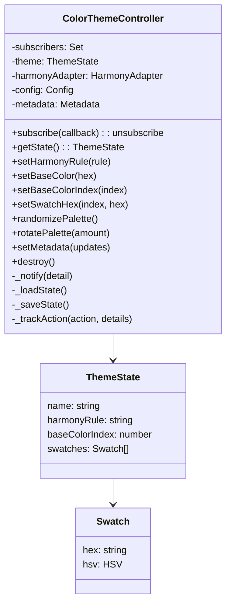

**Current API:**

```javascript
// Create controller
const controller = new ColorThemeController({
  harmonyRule: 'ANALOGOUS',
  swatches: ['#FF0000', '#FF7F00', '#FFFF00', '#00A8FF', '#7F00FF'],
});

// Subscribe to changes
const unsubscribe = controller.subscribe((state, detail) => {
  console.log('State updated:', state);
  console.log('Source:', detail.source);
});

// Update state
controller.setBaseColor('#FF5500');
controller.setHarmonyRule('TRIAD');
```

### 2.2 Event Communication Patterns

Components communicate through three patterns, depending on context:

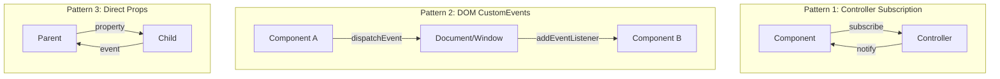

**When to Use Each Pattern:**

| Pattern | Use Case | Example |
|---------|----------|---------|
| Controller Subscription | Shared palette state across components | Wheel ↔ Swatch Rail sync |
| DOM CustomEvents | Cross-block communication | Search → Grid filtering |
| Direct Props/Events | Parent-child within same component tree | Modal → Save Form |

### 2.3 Event Topic Naming Convention

**Naming Pattern:** `{prefix}:{domain}:{action}`

```javascript
// Event Topics (from PLG with modifications)
export const Topics = {
  // Color Tools domain
  COLOR_TOOLS: {
    TAB_CHANGE: 'express:color-tools:tab-change',
    COLOR_SELECTED: 'express:color-tools:color-selected',
    RULE_CHANGE: 'express:color-tools:rule-change',
    ACTION: 'express:color-tools:action',
  },
  
  // Explore Palettes domain
  EXPLORE: {
    SEARCH: 'ac:palette:search',
    FILTER_CHANGE: 'ac:palette:filter-change',
    CARD_CLICK: 'ac:palette:card-click',
    MODAL_OPEN: 'ac:palette:modal-open',
    MODAL_CLOSE: 'ac:palette:modal-close',
  },
  
  // Extract Palette domain
  EXTRACT: {
    IMAGE_SELECTED: 'ac:extract:image-selected',
    EXTRACT_COMPLETE: 'ac:extract:complete',
    SAVE_TO_LIBRARY: 'ac:extract:save-to-library',
  },
  
  // Shared actions
  SHARED: {
    COPY_HEX: 'ac:color:copy-hex',
    SAVE_COMPLETE: 'ac:library:save-complete',
    ERROR: 'ac:color:error',
  },
};
```

**Event Payload Structure:**

```javascript
// Standard event shape
{
  topic: 'express:color-tools:action',
  payload: {
    action: 'set-base-color',
    hex: '#FF5500',
    source: 'wheel',
  },
  meta: {
    timestamp: Date.now(),
    workflow: 'color-tools',
    channel: 'express',
  }
}
```

---

## 3. Component Library

### 3.1 Existing Components

```
libs/color-components/
├── components/
│   ├── color-wheel/              # ✅ Canvas wheel + markers
│   ├── color-palette/            # ✅ Palette with selection
│   ├── color-palette-list/       # ✅ Multiple palettes
│   ├── color-swatch-rail/        # ✅ Vertical swatch display
│   ├── color-harmony-toolbar/    # ✅ Rule selector
│   ├── color-search/             # ✅ Search input
│   ├── ac-color-swatch/          # ✅ Individual swatch
│   ├── ac-color-swatch-list/     # ✅ Swatch list
│   ├── global-colors-ui/         # ✅ Global colors panel
│   ├── progress-circle/          # ✅ Loading indicator
│   └── ...
├── controllers/
│   └── ColorThemeController.js   # ✅ State management
└── utils/
    ├── harmony/
    │   └── HarmonyEngine.js      # ✅ Color calculations
    ├── ColorConversions.js       # ✅ Hex/RGB/HSB conversions
    └── ...
```

### 3.2 Proposed Shared Components

| Component | Purpose | Used By | Priority |
|-----------|---------|---------|----------|
| `color-strip` | Horizontal/vertical color bar display | Explore grid, Modal, Extract results | 🔴 High |
| `color-action-button` | Reusable action button with states | Modal actions, Toolbar | 🔴 High |
| `upload-area` | Drag/drop file upload zone | Extract Palette | 🟡 Medium |
| `floating-toolbar` | Action toolbar with responsive layout | Extract Palette | 🟡 Medium |

### 3.3 Component Reuse Map

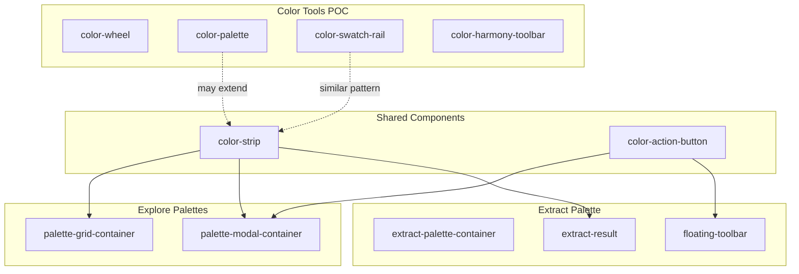

---

## 4. Feature: Color Tools (POC)

### 4.1 Architecture

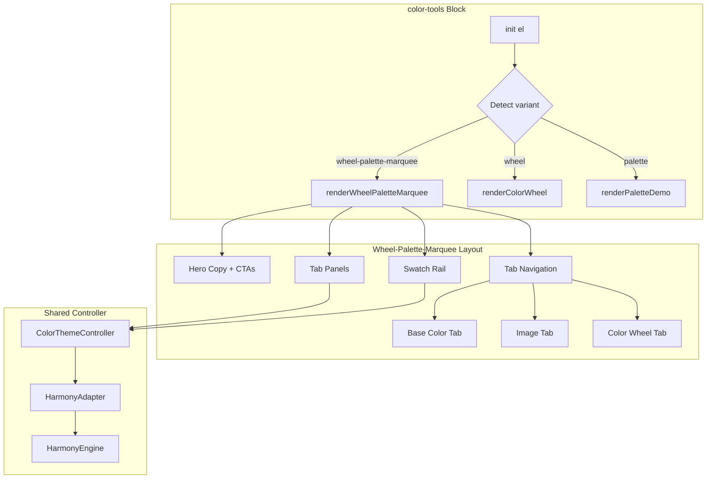

### 4.2 Current Implementation

**Block Variants:**

| Variant | Class | Renders |
|---------|-------|---------|
| Default | `color-tools` | Palette demo |
| Wheel | `color-tools wheel` | Color wheel only |
| Marquee | `color-tools wheel-palette-marquee` | Full tabbed experience |

**Tab System:**

```javascript
const tabs = [
  { id: 'base', label: 'Base color', mount: createBaseColorTool },
  { id: 'image', label: 'Image', mount: createImageExtractor },
  { id: 'wheel', label: 'Color wheel', mount: createWheelWorkspace },
];
```

**URL Routing:**
- Parameter: `?color-tools-tab=<id>`
- Updates via `history.replaceState` on tab change
- Reads initial tab from URL on load

### 4.3 Gap Analysis

**From Legacy colorweb-develop:**

| Capability | Legacy | POC | Gap |
|------------|--------|-----|-----|
| Wheel markers + spokes | ✅ React components | ⚠️ Basic wheel | Need draggable markers |
| Swatch CRUD | ✅ Add/remove/reorder | ❌ Fixed count | Need swatch management |
| Tint sliders | ✅ Per-swatch HSB | ❌ None | Need slider UI |
| Eyedropper | ✅ @adobecolor/react-eyedropper | ❌ None | Need native picker |
| Quick actions | ✅ Randomize, Complementary, etc. | ⚠️ Partial | Need action bar |
| Image extraction | ✅ Worker + k-means | ⚠️ Simple sampling | Need proper algorithm |
| Save to Libraries | ✅ Full CC integration | ❌ None | Need API integration |
| Gradient tab | ✅ Full | ❌ None | New feature |
| Accessibility tab | ✅ Contrast tools | ❌ None | New feature |

**Priority Workstreams:**

1. **State Controller Enhancements** — Metadata, analytics, quick actions
2. **Component Enhancements** — Markers, swatch CRUD, sliders
3. **Image Extraction Parity** — Worker-based clustering
4. **CC Libraries Integration** — Save/export workflows

---

## 5. Feature: Explore Palettes

### 5.1 Reference Diagrams

> **Note:** These diagrams are from the Cano planning documents.

- **Component Architecture:**

  

- **Implementation Phases:**

  

- **Implementation Plan:**

  

### 5.2 Architecture & Routing

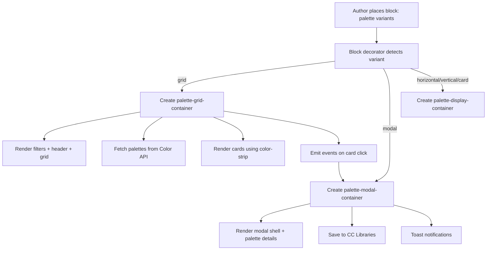

**Authoring Variants:**

| Variant | Class | Usage |
|---------|-------|-------|
| Grid | `palette (grid)` | Main explore/discover view with filters |
| Modal | `palette (modal)` | Detailed palette view |
| Horizontal | `palette (horizontal)` | Horizontal color strip |
| Vertical | `palette (vertical)` | Vertical color strip |
| Card | `palette (card)` | Individual palette card |

### 5.3 UX Flow

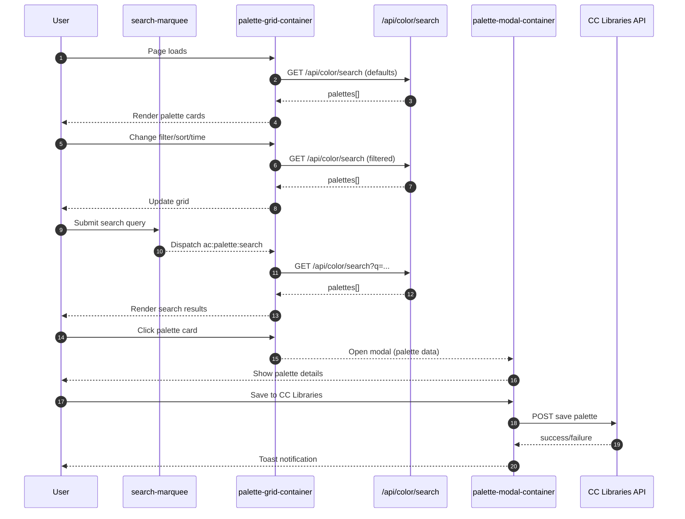

### 5.4 Ticket Breakdown

#### Phase 1 — Core Features (Tickets 1–8)

| Ticket | Title | SP | Hours | Dependencies |
|--------|-------|-----|-------|--------------|
| T1 | Grid Variant + color-strip | 5 | 20-24h | — |
| T2 | Filter Dropdowns | 3 | 12-16h | T1 |
| T3 | Filter API Integration | 3 | 12-16h | T1, T2 |
| T4 | Search Integration | 3 | 12-16h | T1, T3 |
| T5 | Search Enhancement (optional) | 2 | 8h | T4 |
| T6 | Card Actions + action-button | 3 | 12-16h | T1 |
| T7 | Responsive Polish | 1 | 4h | T3, T4, T6 |
| T8 | Analytics | 2 | 8h | T7 |

#### Phase 2 — Modal Features (Tickets 9–13)

| Ticket | Title | SP | Hours | Dependencies |
|--------|-------|-----|-------|--------------|
| T9 | Modal Basic Structure | 3 | 12-16h | T1 |
| T10 | Modal Color Display & Actions | 5 | 20-24h | T9 |
| T11 | Save to CC Libraries | 5 | 20-24h | T9 |
| T12 | Toast Notifications | 2 | 8h | T11 |
| T13 | Action Buttons Integration | 3 | 12-16h | T6, T9 |

**Total: 40 SP | 152-184 hours | ~20 working days**

### 5.5 Dependency Graph

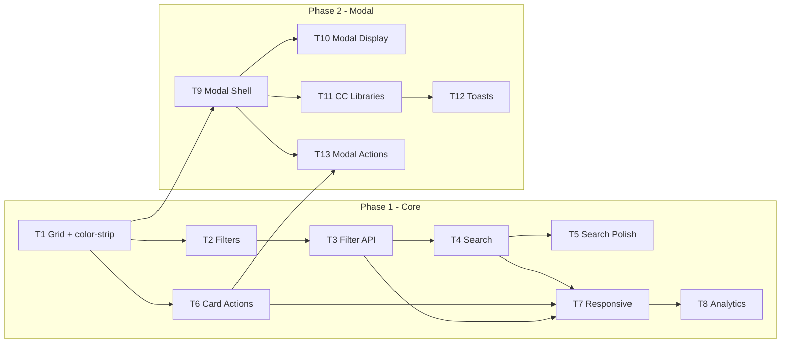

### 5.6 Timeline

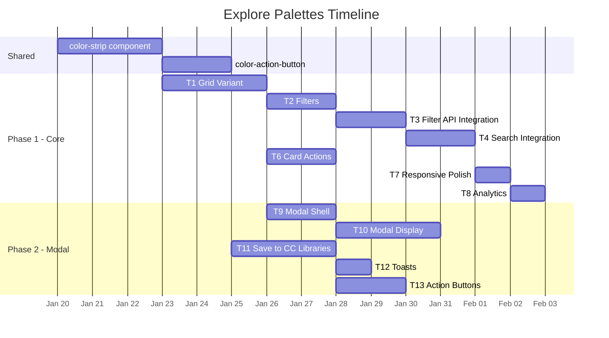

---

## 6. Feature: Extract Palette

### 6.1 Reference Diagrams

- **Component Architecture:**

  

- **Implementation Plan:**

  

- **Timeline:**

  

### 6.2 Architecture & Routing

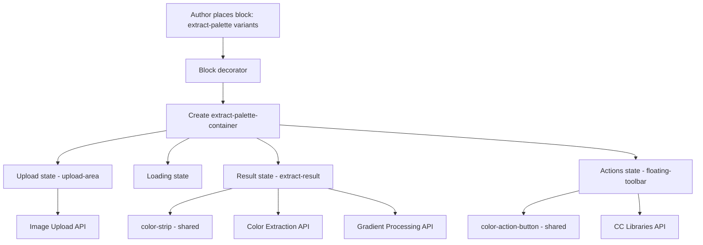

**Authoring Variants:**

| Variant | Class | Usage |
|---------|-------|-------|
| Palette | `extract-palette (palette)` | Extract color palette |
| Gradient | `extract-palette (gradient)` | Extract gradient |

### 6.3 UX Flow

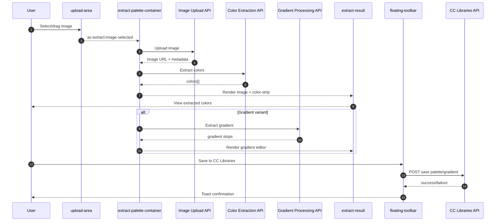

### 6.4 Ticket Breakdown

#### Phase 1 — Foundation

| Ticket | Title | SP | Hours | Dependencies |
|--------|-------|-----|-------|--------------|
| T1 | Upload Area | 3 | 12-16h | — |
| T2 | Loading State | 2 | 8h | — |
| T11 | Main Page Integration | 3 | 12-16h | — |

#### Phase 2 — Core Extraction

| Ticket | Title | SP | Hours | Dependencies |
|--------|-------|-----|-------|--------------|
| T3 | Result Display | 5 | 20-24h | T1, T2, T4 |
| T4 | Color Strip Component | 3 | 12-16h | — (shared) |
| T5 | Floating Toolbar | 4 | 16-20h | T3 |

#### Phase 3 — Advanced Features

| Ticket | Title | SP | Hours | Dependencies |
|--------|-------|-----|-------|--------------|
| T6 | Image Reveal | 4 | 16-20h | T3 |
| T7 | Color Editing Handles | 3 | 12-16h | T3, T4 |
| T9 | Gradient Variant | 3 | 12-16h | T1, T2, T3 |
| T8 | Gradient Editor | 4 | 16-20h | T9 |

#### Phase 4 — Polish

| Ticket | Title | SP | Hours | Dependencies |
|--------|-------|-----|-------|--------------|
| T10 | Image Effects Integration | 2 | 8h | T6 |

**Total: 36 SP | 144-180 hours | ~22 working days**

### 6.5 Dependency Graph

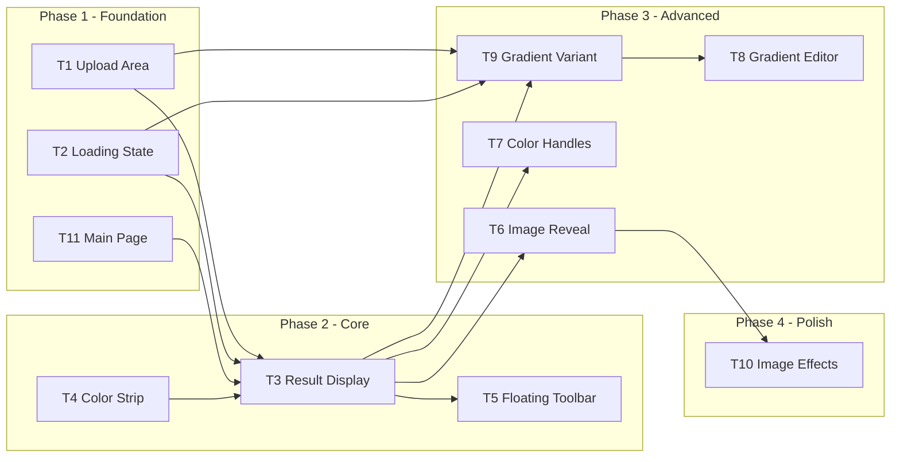

### 6.6 Timeline

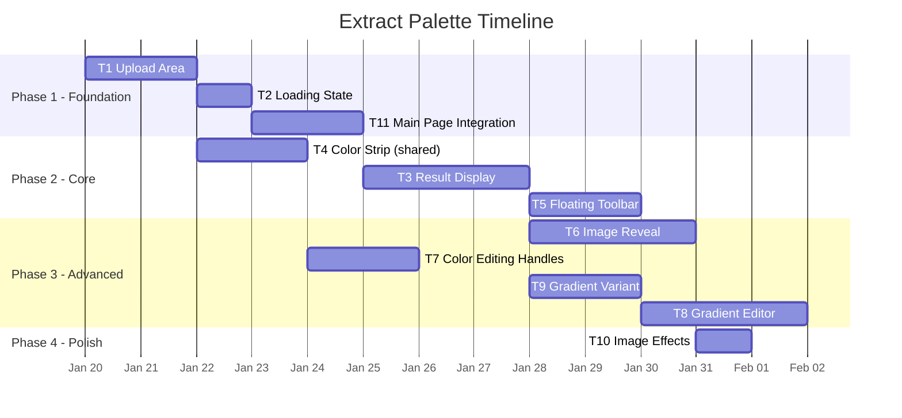

---

## 7. Backend Services

### 7.1 Service Inventory

| Service | Config Key | Purpose | Surfaces |
|---------|------------|---------|----------|
| **Ethos Theme APIs** | `ETHOS_ENDPOINT` | Palette search, curated lists | Explore Palettes |
| **Kuler Legacy APIs** | `KULER_ENDPOINT` | Back-compat for old palette IDs | Deep links |
| **Adobe Stock APIs** | `STOCK_ENDPOINT` | Image search, palette from images | Explore cards |
| **Autotag** | `AUTOTAG_ENDPOINT` | Tags and moods from palettes | Explore search, Extract |
| **CC Libraries** | `CCLIBRARIES_ENDPOINT` | Save/update/delete palettes | Save workflows |
| **Behance** | `BEHANCE_ENDPOINT` | Community signals, trending | Explore ranking |
| **Universal Search** | `UNIVERSAL_SEARCH_ENDPOINT` | Search suggestions | Explore search |

### 7.2 API Contracts

#### Color Search API

```javascript
// Request
GET /api/color/search?q={query}&sort={sort}&timeRange={timeRange}&type={type}

// Response
{
  "items": [
    {
      "id": "ethos:theme:123",
      "name": "Eternal Sunshine",
      "hex": ["#F4EAD5", "#9AC0D5", "#49738C", "#BF6A40"],
      "source": "ethos",
      "stats": { "views": 15230, "uses": 832 }
    }
  ],
  "cursor": "eyJwYWdlIjoyfQ==",
  "total": 1523
}
```

#### CC Libraries API

```javascript
// Save palette
POST /api/color/libraries/themes
{
  "name": "My Color Theme",
  "hex": ["#FF7500", "#122583", "#0077FF", "#6BB5FF", "#FFF7E0"],
  "source": "express-color-tools",
  "workflow": "color-tools-wheel"
}

// Response
{
  "id": "lib:theme:456",
  "name": "My Color Theme",
  "createdAt": "2026-01-05T12:00:00Z"
}
```

### 7.3 Proxy Pattern

All services should be accessed through Franklin proxy endpoints:

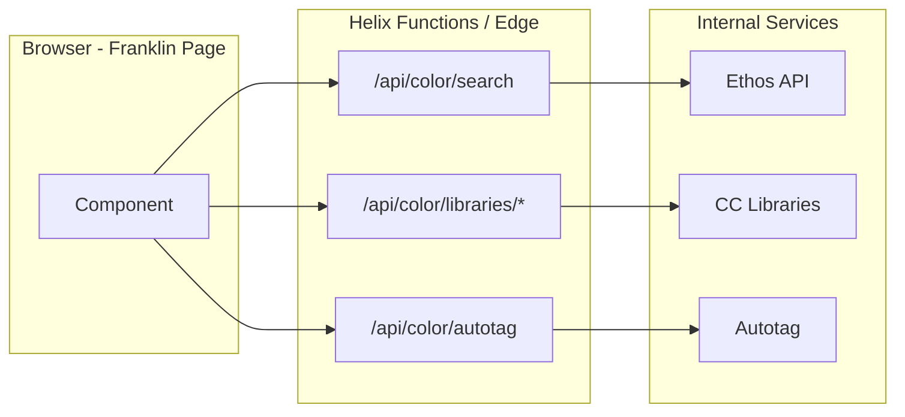

**Proxy Responsibilities:**
- Read IMS cookies, attach auth headers
- Rate limiting and validation
- Response normalization
- Error handling

---

## 8. Combined Roadmap

### 8.1 Critical Path

**Shared Component Gates:**
- `color-strip` — Required by Explore grid, modal, and Extract results
- `color-action-button` — Required by modal actions and toolbar

**Critical Dependencies:**

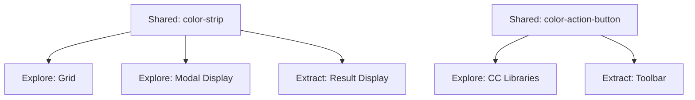

### 8.2 Combined Dependency Graph

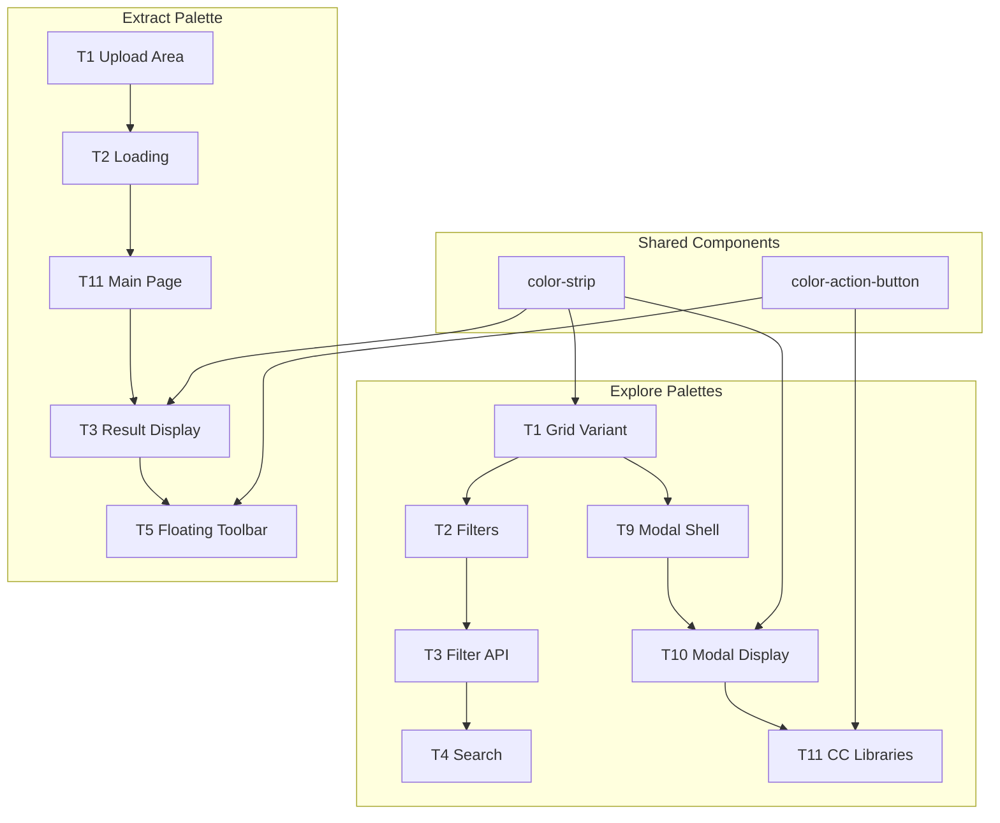

### 8.3 Master Timeline

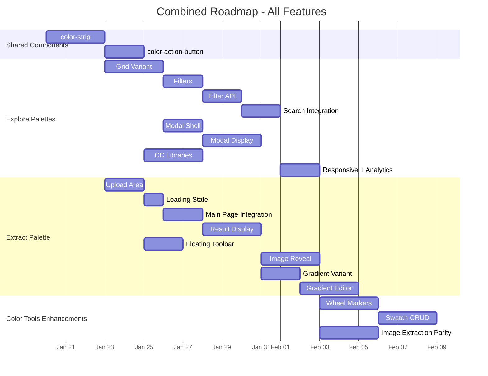

---

## 9. Implementation Guidelines

### 9.1 Block Development Standards

**File Structure:**

```
blocks/
  block-name/
    block-name.css      # Block-scoped styles
    block-name.js       # ESM module with default export
```

**JavaScript Pattern:**

```javascript
// ✅ REQUIRED: Standard block export
export default async function init(el) {
  const isFirstSection = el.closest('.section') === document.querySelector('.section');
  
  if (isFirstSection) {
    // Phase E: Immediate structure for LCP
    createBasicShell(el);
  }
  
  // Phase L: Component initialization
  const controller = new ColorThemeController();
  initializeComponents(el, controller);
}
```

**CSS Scoping:**

```css
/* ✅ REQUIRED: All selectors scoped to block */
.block-name {
  /* container styles */
}

.block-name .element {
  /* nested element styles */
}

/* ❌ ANTI-PATTERN: Global selectors */
.element { /* affects other blocks */ }
```

### 9.2 Component Development Standards

**File Structure:**

```
libs/color-components/components/
  component-name/
    index.js           # LitElement definition
    styles.css.js      # CSS template literal
    __snapshots__/     # Test snapshots
```

**LitElement Pattern:**

```javascript
import { LitElement, html } from '../../deps/lit.js';
import { styles } from './styles.css.js';

class ComponentName extends LitElement {
  static styles = styles;
  
  static properties = {
    propName: { type: String },
    _internalState: { state: true },
  };
  
  render() {
    return html`<div class="component-name">...</div>`;
  }
}

customElements.define('component-name', ComponentName);
```

### 9.3 Testing Requirements

**Unit Tests:**

```javascript
describe('Component Name', () => {
  it('renders with default props', async () => {
    const el = await fixture(html`<component-name></component-name>`);
    expect(el).to.exist;
  });
  
  it('emits events on interaction', async () => {
    const el = await fixture(html`<component-name></component-name>`);
    const handler = sinon.spy();
    el.addEventListener('custom-event', handler);
    
    // Trigger interaction
    el.shadowRoot.querySelector('button').click();
    
    expect(handler).to.have.been.calledOnce;
  });
});
```

**Snapshot Tests:**

```javascript
it('matches snapshot', async () => {
  const el = await fixture(html`<component-name prop="value"></component-name>`);
  await expect(el).shadowDom.to.equalSnapshot();
});
```

---

## 10. Appendix

### 10.1 Repository Structure

```
express/code/
├── blocks/
│   ├── color-tools/          # Main color tools block
│   ├── explore-palettes/     # Explore palettes block (planned)
│   └── extract-palette/      # Extract palette block (planned)
│
├── libs/
│   └── color-components/
│       ├── components/       # Lit web components
│       │   ├── color-wheel/
│       │   ├── color-palette/
│       │   ├── color-swatch-rail/
│       │   ├── color-harmony-toolbar/
│       │   ├── color-strip/         # NEW - shared
│       │   ├── color-action-button/ # NEW - shared
│       │   ├── palette-grid-container/    # NEW
│       │   ├── palette-modal-container/   # NEW
│       │   ├── extract-palette-container/ # NEW
│       │   ├── upload-area/               # NEW
│       │   └── ...
│       ├── controllers/
│       │   └── ColorThemeController.js
│       └── utils/
│           ├── harmony/
│           │   └── HarmonyEngine.js
│           └── ColorConversions.js
│
└── docs/
    └── Color-Plans/
        ├── combined-architectural-plan.md  # This document
        ├── plans-review.md
        ├── color-brad-plans/
        ├── color-cano-plan/
        └── color-PLG-plans/
```

### 10.2 Event Contract Reference

**Color Tools Events:**

| Event | Payload | Source | Description |
|-------|---------|--------|-------------|
| `express:color-tools:tab-change` | `{ tab: string }` | Block | Tab navigation |
| `express:color-tools:color-selected` | `{ color: object, source: string }` | Wheel/Palette | Color selected |
| `express:color-tools:action` | `{ action, channel, workflow, timestamp }` | Controller | Analytics |

**Explore Palettes Events:**

| Event | Payload | Source | Description |
|-------|---------|--------|-------------|
| `ac:palette:search` | `{ query: string }` | Search | Search submitted |
| `ac:palette:filter-change` | `{ filters: object }` | Grid | Filters changed |
| `ac:palette:card-click` | `{ palette: object }` | Grid | Card clicked |

**Extract Palette Events:**

| Event | Payload | Source | Description |
|-------|---------|--------|-------------|
| `ac:extract:image-selected` | `{ file, source }` | Upload | Image selected |
| `ac:extract:complete` | `{ colors[], gradient? }` | Container | Extraction done |
| `ac:extract:save-to-library` | `{ payload }` | Toolbar | Save initiated |

### 10.3 Legacy System Audit

**From colorweb-develop (React/Redux):**

| Container | Purpose | Migration Status |
|-----------|---------|------------------|
| `Create.jsx` | Main tabbed shell | ✅ Migrated to block tabs |
| `Colorwheel.jsx` | Color wheel UI | ⚠️ Partial - needs markers |
| `CreateFromImage.jsx` | Image extraction | ⚠️ Partial - needs k-means |
| `CreateGradientFromImage.jsx` | Gradient extraction | ❌ Not started |
| `AccessibilityTools.jsx` | Contrast analyzer | ❌ Not started |
| `SavePanel.jsx` | CC Libraries save | ❌ Not started |
| `CreateQuickActions.jsx` | Quick action buttons | ❌ Not started |

**Redux State Shape (for reference):**

```javascript
{
  create: {
    swatches: [],
    markers: [],
    activeSwatch: 0,
    colorMode: 'HSB',
    colorMood: 'colorful',
    workflow: 'COLORWHEEL',
    ingestWorkflow: [],
    themeMetadata: {}
  },
  user: {
    locale: 'en-US',
    isLoggedIn: false,
    featureFlags: {}
  }
}
```

---

## Document History

| Version | Date | Author | Changes |
|---------|------|--------|---------|
| 1.0.0 | 2026-01-05 | Brad Johnson | Initial combined document |

---

*This document consolidates planning from color-brad-plans (POC), color-cano-plan (features), and color-PLG-plans (architecture) into a single source of truth.*

